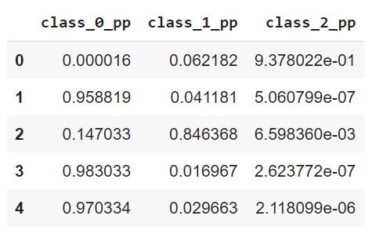

# ML_Iris_Classification

## Description

Classification of iris flowers is perhaps the best-known example of machine learning.

The aim is to classify iris flowers among three species (Setosa, Versicolor, or Virginica) from sepals' and petals' length and width measurements.

The iris data set contains fifty instances of each of the three species.

The central goal is to design a model that makes proper classifications for new flowers. In other words, one which exhibits good generalization.

## Solution

Machine Learning Algorithm - Logistic Regression 

## How to run?

1. Download file Iris_Classification.ipynb

2. create google account

3. open Gooble Colab
> https://colab.research.google.com/notebooks/intro.ipynb#recent=true

4. File -> Upload NoteBook

5. click the triangle button to run the code one by one:

## Results Screenshots:

Data Analysis:

Model Evaluation:

Test Prediction:

## Presentation
https://docs.google.com/presentation/d/1O8sjvlKpP03iDisS21koyVYaEY2ps76Q_KjZcgzOTsk/edit?usp=sharing

